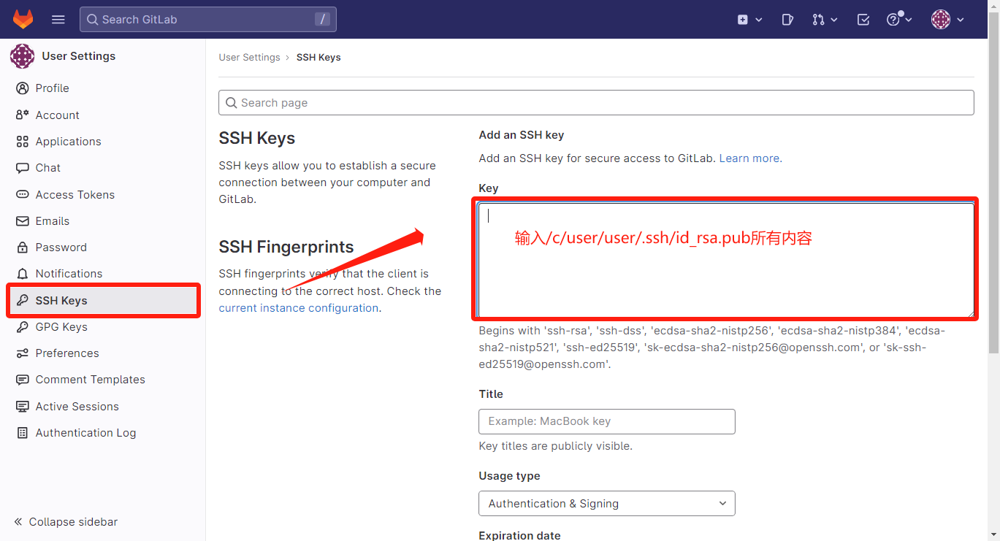
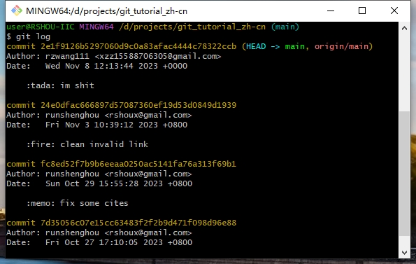
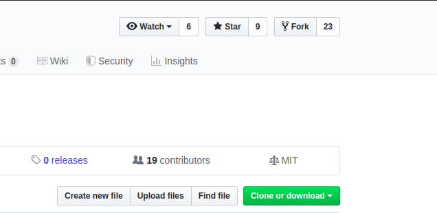
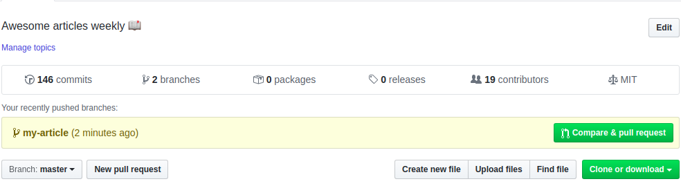
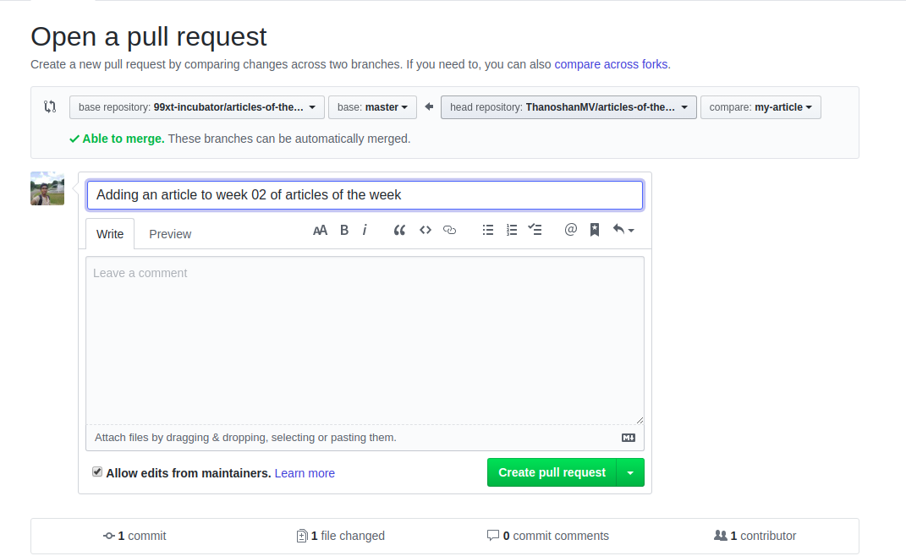

# Git 使用教程


# Table of Content
- [Git 使用教程](#git-使用教程)
- [Table of Content](#table-of-content)
- [0. Related Resources](#0-related-resources)
- [1. Git 下载安装](#1-git-下载安装)
- [2. Git 创建仓库](#2-git-创建仓库)
  - [2.1 git init（optional）](#21-git-initoptional)
    - [2.1.1 使用当前目录创建仓库](#211-使用当前目录创建仓库)
    - [2.1.2 使用指定目录创建仓库](#212-使用指定目录创建仓库)
    - [2.1.3 向仓库添加文件](#213-向仓库添加文件)
  - [2.2 git clone](#22-git-clone)
  - [2.3 git config](#23-git-config)
- [3. Git 基本操作](#3-git-基本操作)
  - [3.1 一般流程](#31-一般流程)
  - [3.2 git add](#32-git-add)
  - [3.3 git commit](#33-git-commit)
  - [3.4 git push](#34-git-push)
  - [3.5 git checkout](#35-git-checkout)
  - [3.6 git pull](#36-git-pull)
  - [3.7 optional commands](#37-optional-commands)
    - [3.7.1 git status](#371-git-status)
    - [3.7.2 git diff](#372-git-diff)
    - [3.7.3 git rm](#373-git-rm)
    - [3.7.4 git mv](#374-git-mv)
    - [3.7.5 恢复到刚clone 的状态](#375-恢复到刚clone-的状态)
- [4. Git 分支管理（optional）](#4-git-分支管理optional)
  - [4.1 Simple workflow](#41-simple-workflow)
  - [4.2 分支管理](#42-分支管理)
    - [4.2.1 列出分支](#421-列出分支)
    - [4.2.2 删除分支](#422-删除分支)
    - [4.2.3 分支合并](#423-分支合并)
    - [4.2.4 合并冲突](#424-合并冲突)
- [5. Git 提交历史（optional）](#5-git-提交历史optional)
  - [5.1 git log](#51-git-log)
  - [5.2 git blame](#52-git-blame)
- [6. 远程仓库](#6-远程仓库)
  - [6.1 本地创建 ssh key](#61-本地创建-ssh-key)
  - [6.2 配置GitHub/GitLab](#62-配置githubgitlab)
    - [6.2.1 GitHub](#621-github)
    - [6.2.2 GitLab](#622-gitlab)
  - [6.3 版本回退](#63-版本回退)
    - [6.3.1 Reference](#631-reference)
    - [6.3.2 具体实践](#632-具体实践)
  - [6.4 Pull Request(PR)](#64-pull-requestpr)
    - [6.4.1 Reference](#641-reference)
    - [6.4.2 基本概念](#642-基本概念)
    - [6.4.3 具体实践](#643-具体实践)
    - [6.4.4 同步复刻的main分支](#644-同步复刻的main分支)
- [7. gitigore](#7-gitigore)
  - [7.1 gitigore的作用](#71-gitigore的作用)
  - [7.2 gitigore的使用方法](#72-gitigore的使用方法)
  - [7.3 gitigore的语法规则](#73-gitigore的语法规则)
    - [7.3.1 注释](#731-注释)
    - [7.3.2 忽略文件夹](#732-忽略文件夹)
    - [7.3.3 取反](#733-取反)
    - [7.3.4 glob模式匹配](#734-glob模式匹配)


# 0. Related Resources

- [Quick Start of Git](https://www.runoob.com/w3cnote/git-five-minutes-tutorial.html)
- [GitHub 简明教程](https://www.runoob.com/w3cnote/git-guide.html)
- [Git tutorial](https://www.runoob.com/git/git-tutorial.html)
- [GitLab使用教程](https://www.cnblogs.com/vs1435/p/11775861.html)

本文主要根据 [Git tutorial](https://www.runoob.com/git/git-tutorial.html) 撰写，旨在帮助快速上手Git。
有些章节内容参考自博客，分别在章节开头声明了资料来源。

# 1. Git 下载安装

点击链接[[Git-2.42.0.2-64-bit](https://registry.npmmirror.com/-/binary/git-for-windows/v2.42.0.windows.2/Git-2.42.0.2-64-bit.exe)]即可开始下载，然后直接安装即可。

# 2. Git 创建仓库

⭐ [2.1](#21-git-initoptional)部分可跳过，可以直接去看[2.2](#22-git-clone)部分

## 2.1 git init（optional）

### 2.1.1 使用当前目录创建仓库

```bash
# 先把路径转到你想创建repo的目录
cd /path/to/your/repo
git init
```

### 2.1.2 使用指定目录创建仓库

```bash
git init /path/to/your/repo
```

### 2.1.3 向仓库添加文件

如果**当前目录下**有几个文件想要纳入版本控制，需要先用 git add 命令告诉 Git 开始对这些文件进行跟踪，然后提交：

```bash
git add *.c
git add README
git commit -m 'init repo'

# 以上命令将目录下以 .c 结尾及 README 文件提交到仓库中。
# 也可以将命令简化为
git commit -a -m 'init repo'
```

## 2.2 git clone

使用 **git clone** 从现有 Git 仓库中拷贝项目，克隆仓库的命令格式为：

```bash
git clone <repo>

# 克隆repo到指定的目录
git clone <repo> <directory>

# eg.1 git clone http://101.42.253.43:14841/library/C0S00_Library
# eg.2 git clone http://101.42.253.43:14841/library/C0S00_Library /d/project/C0S00_Library
```

## 2.3 git config

```bash
# 显示当前git配置信息
git config --list

# 编辑git配置文件
git config -e
git config -e --global # 针对系统上所有仓库(全局)

# 设置提交代码时的用户信息
git config --global user.name "runshenghou"
git config --global user.email rshoux@gmail.com
```

# 3. Git 基本操作


- Git 的工作就是创建和保存你项目的快照及与之后的快照进行对比。
- Git 常用的是以下 6 个命令：**git clone、git add 、git commit、git push、git checkout、git pull**，[git clone](#22-git-clone) 已经在 [Git 创建仓库](#2-Git-创建仓库)中介绍过，因而不再赘述，其余命令后面会详细介绍。
- 3.1-3.6 部分需要看一下，3.7部分可跳过

## 3.1 一般流程

```bash
# clone 克隆仓库
cd /path/to/repo
git clone <repo>

# add 将修改过的文件提交到缓存区（staging area）
git add file_you_modified

# commit 将缓存区的内容提交到本地仓库（local repo）
git commit -m "message"

# push 上传代码并合并至远程仓库（remote repo）
git push
```

## 3.2 git add

- **用途：git add** 命令可将该文件的修改添加到暂存区（staging area）。
- 命令格式如下：

```bash
# 添加指定目录到暂存区
git add [dir]

# 添加一个或多个文件到暂存区
git add [file1] [file2] ...

# 添加当前目录下的所有文件到暂存区
git add .
```

## 3.3 git commit

- **用途：git commit** 命令将暂存区内容添加到本地仓库（local repo）中。
- 命令格式如下：

```bash
# 提交暂存区到本地仓库中,[message] 可以是一些备注信息。
git commit -m [message]

# 提交暂存区的指定文件到仓库区：
git commit [file1] [file2] ... -m [message]

# -a 参数设置修改文件后不需要执行 git add 命令，直接来提交
git commit -a -m [message]
```

## 3.4 git push

- **用途：git push** 命令用于从将本地的分支版本上传到远程并合并。
- 命令格式如下：

```bash
git push <远程主机名> <本地分支名>:<远程分支名>

# 若本地分支名与远程分支名相同，则远程分支名可省略
git push <远程主机名> <本地分支名>

# 强制推送使用 --force 参数
git push --force <远程主机名> <本地分支名>

# 删除主机分支使用 --delete 参数
git push <远程主机名> --delete <远程分支名>

```

在创建完GitHub Repo第一次提交时，应使用`-u`参数，`-u`: 也可以写作 `--set-upstream`，用于在推送代码的同时，将本地分支与远程分支进行关联，使得以后的推送和拉取操作更加方便。

```bash
# 由于现在GitHub新创建的repo分支名默认为main
# 为了统一分支命名，所以把分支重命名为main，更加规范
git branch -M main

# 首次提交使用，之后直接使用git push即可
git push -u origin main
```

**注意**：
只有在第一次commit后才会创建分支，才能使用`git branch -M`命令。

## 3.5 git checkout

- 用途：**git checkout** 命令用于在不同的分支之间切换、恢复文件、创建新分支等操作。
- 更多分支管理内容参考 [Git 分支管理](#4-git-分支管理optional) 部分。
- 命令格式如下：

```bash
# 以下命令允许你从当前分支切换到指定的分支 <branch-name>:
git checkout <branch-name>

# 以下命令用于创建一个新分支 <new-branch-name> 并立即切换到新创建的分支:
git checkout -b <new-branch-name>

# 以下命令可以将指定文件 <file> 恢复到最新的提交状态，丢弃所有未提交的更改，这对于撤销不需要的更改非常有用：
git checkout -- <file>

# 可以使用提交的哈希值 <commit-hash> 或 标签 <tag_name> 来切换到特定的提交状态。
git checkout <tag-name>

# 如果的工作区中的更改尚未添加（add）和提交（commit），将工作区恢复为本地仓库的状态：
git checkout .
```

## 3.6 git pull

- 用途：**git pull** 命令用于从远程获取代码并合并本地的版本，即**更新到最新版本**。
- 命令格式：

```bash
git pull
git pull <远程主机名> <远程分支名>:<本地分支名>
```

## 3.7 optional commands

### 3.7.1 git status

- **git status** 是一个用于查看 Git 仓库当前状态的命令。
- **git status** 命令可以查看在你上次提交之后是否有对文件进行再次修改。

```bash
git status
git status -s
# 通常使用 '-s' 参数来获得简短的输出结果
```

### 3.7.2 git diff

- git diff 命令比较文件的不同，即比较文件在暂存区和工作区的差异。
- git diff 命令显示已写入暂存区和已经被修改但尚未写入暂存区文件的区别。

```bash
# 显示暂存区 (staging area) 和工作区 (workplace) 的差异
git diff [file]

# 显示暂存区 (staging area) 和上一次commit (local repo) 的差异
git diff --cached [file]
```

### 3.7.3 git rm

- 类似于Linux命令`rm`

```bash
git rm <file>              # 将文件从暂存区和工作区中删除
git rm -f <file>           # 强行从暂存区和工作区中删除修改后的文件

# 如果想把文件从暂存区域移除，但仍然希望保留在当前工作目录中，换句话说，仅是从跟踪清单中删除，使用 --cached 选项即可：
git rm --cached <file>
```

### 3.7.4 git mv

- 移动或重命名工作区文件。

### 3.7.5 恢复到刚clone 的状态

```bash
git reset --hard HEAD
git clean -f –d
```

# 4. Git 分支管理（optional）

不管是对于小项目还是团队协作的项目，使用仓库时，最好新建一个分支。
分支名称应该保持简短，并且能够反映我们所做的工作。

几乎每一种版本控制系统都以某种形式支持分支，一个分支代表一条独立的开发线。
使用分支意味着你可以从开发主线上分离开来，然后在不影响主线的同时继续工作。


## 4.1 Simple workflow

```bash
# 创建分支
git branch <branchname>

# 切换分支
git checkout <branchname>

# 创建并切换到新分支
git checkout -b <branchname>

# 合并分支
git merge [branchname]
```

## 4.2 分支管理

### 4.2.1 列出分支

列出分支基本命令：

```bash
git branch
```

没有参数时，**git branch** 会列出你在本地的分支。

当你执行 **git init** 的时候，默认情况下 Git 就会为你创建 **master** 分支。

使用分支将工作切分开来，从而让我们能够在不同开发环境中做事，并来回切换。

### 4.2.2 删除分支

```bash
git branch -d <branchname>
```

### 4.2.3 分支合并

```bash
git merge [branchname]
```

合并完后需要删除分支。

### 4.2.4 合并冲突

- 当Git无法自动合并分支时，就必须首先解决冲突。解决冲突后，再提交，合并完成。
- 解决冲突就是把Git合并失败的文件手动编辑为我们希望的内容，再提交。
- 用`git log --graph`命令可以看到分支合并图。

# 5. Git 提交历史（optional）

## 5.1 git log

在使用 Git 提交了若干更新之后，又或者克隆了某个项目，想回顾下提交历史，我们可以使用 **git log** 命令查看。

**git log** 命令用于查看 Git 仓库中提交历史记录。

**git log** 显示了从最新提交到最早提交的所有提交信息，包括提交的哈希值、作者、提交日期和提交消息等。

**git log** 命令的基本语法：

```bash
git log [选项] [分支名/提交哈希]
```

常用的选项包括：

- `p`：显示提交的补丁（具体更改内容）。
- `-oneline`：以简洁的一行格式显示提交信息。
- `-graph`：以图形化方式显示分支和合并历史。
- `-decorate`：显示分支和标签指向的提交。
- `-author=<作者>`：只显示特定作者的提交。
- `-since=<时间>`：只显示指定时间之后的提交。
- `-until=<时间>`：只显示指定时间之前的提交。
- `-grep=<模式>`：只显示包含指定模式的提交消息。
- `-no-merges`：不显示合并提交。
- `-stat`：显示简略统计信息，包括修改的文件和行数。
- `-abbrev-commit`：使用短提交哈希值。
- `-pretty=<格式>`：使用自定义的提交信息显示格式。

## 5.2 git blame

**git blame** 命令用于逐行显示指定文件的每一行代码是由谁在什么时候引入或修改的。

git blame 可以追踪文件中每一行的变更历史，包括作者、提交哈希、提交日期和提交消息等信息。

如果要查看指定文件的修改记录可以使用 git blame 命令，格式如下：

```bash
git blame [选项] <文件路径>
```

常用的选项包括：

- `L <起始行号>,<结束行号>`：只显示指定行号范围内的代码注释。
- `C`：对于重命名或拷贝的代码行，也进行代码行溯源。
- `M`：对于移动的代码行，也进行代码行溯源。
- `C -C` 或 `M -M`：对于较多改动的代码行，进行更进一步的溯源。
- `-show-stats`：显示包含每个作者的行数统计信息。

# 6. 远程仓库

## 6.1 本地创建 ssh key

- 设置全局变量

```bash
git config --global user.name "YourName"
git config --global user.email email_address@server.com
```

- 生成ssh key 命令

```bash
ssh-keygen -t rsa -C "rshoux@gmail.com"
```

后面的邮箱改为你在github上注册的邮箱，之后会要求确认路径和输入密码，我们这使用默认的一路回车就行。成功的话会在`~/`下生成`.ssh`文件夹（Windows中的`~/`路径往往是`/C/user/user_name`），进去打开`id_rsa.pub`，复制里面的内容，即`key`。

## 6.2 配置GitHub/GitLab

### 6.2.1 GitHub

登录GitHub后依次点击：头像-Settings


为了验证是否成功，在git bash下输入：

```bash
ssh -T git@github.com
```

如果是第一次的会提示是否continue，输入yes就会看到：You've successfully authenticated, but GitHub does not provide shell access 。这就表示已成功连上GitHub。

🌟 如何将本地仓库提交到远程仓库

- 若本地的repo是从GitHub直接clone下来的，则修改完本地repo后直接使用`git push`即可将更改提交到远程GitHub仓库。
- 若从GitHub新建一个远程仓库使用本地管理，则需要先配置远程repo，之后再进行git push。
  
    ```bash
    git remote add origin git@github.com:yourName/yourRepo.git
    ```
    
    `yourName`和`yourRepo`表示你在GitHub的用户名和仓库，加完之后进入.git，打开config，这里会多出一个remote "origin"内容，这就是刚才添加的远程地址，也可以直接修改config来配置远程地址。

如果在使用命令`git remote add`时报错：`fatal: remote origin already exists.`

- 这说明本地库已经关联了一个名叫`origin`的远程库，此时，可以先用`git remote -v`查看远程库信息，之后
  
    ```bash
    # 我们可以删除已有的GitHub远程库：
    git remote rm origin
    # 再关联远程库
    git remote add origin git@gitee.com:yourName/yourRepo.git
    ```
    

使用多个远程库时，我们要注意，git给远程库起的默认名称是`origin`，如果有多个远程库，我们需要用不同的名称来标识不同的远程库。

```bash
git remote add github git@github.com:yourName/yourRepo.git
git remote add gitee  git@gitee.com:yourName/yourRepo.git

# 此时push命令需要发生改变
git push github master
git push gitee  master

git push <remote_repo_name> <branch_name>
```


### 6.2.2 GitLab

登录GitLab，如下图操作。




## 6.3 版本回退

### 6.3.1 Reference

🌟 [6.3节](#63-版本回退) 参考CSDN文章：[Git恢复之前版本的两种方法reset、revert（图文详解）](https://blog.csdn.net/yxlshk/article/details/79944535)

### 6.3.2 具体实践

- 先通过`git log`查看之前的版本，找到需要回退的目标版本号



- 使用如下代码回退，并重新push之前的版本。

```bash
git reset --hard 目标版本号
git push -f
```

此时如果用`git push`会报错，因为我们本地库版本比远程库的要旧，所以我们要用`git push -f`强制推送上去。

## 6.4 Pull Request(PR)

### 6.4.1 Reference

🌟 [6.2.4节](#624-pull-requestpr) 参考博客：[如何在 GitHub 提交第一个 pull request](https://www.freecodecamp.org/chinese/news/how-to-make-your-first-pull-request-on-github/)

### 6.4.2 基本概念

**1. 什么是复刻（Fork）？**

- 我们可以通过复刻操作将喜爱的仓库保存自己的GitHub账户中，以便独立地对其进行操作。

- 通过复刻，我们可以得到包含完整版本历史的目标仓库的实例，之后可以对复刻得到的仓库进行任意操作而不会影响到原始仓库。

**2. 什么是拉取请求（Pull Request, PR）？**

- 将自己对复刻（fork）项目的修改，合并到原始项目中，不过是否接受修改取决于拥有原始项目的用户。

- 拉取请求是为团队项目或开源项目做贡献的一种方式。

### 6.4.3 具体实践

- **复刻仓库：** 点击页面顶部的“fork”按钮即可复刻仓库，这将在你的账户中创建此仓库的完整实例。



- **克隆仓库：** 账户中已经包含了这个仓库，将它克隆到本地来进行编辑。

```bash
# 把仓库克隆到本地
git clone [HTTP ADDRESS]
# 进入项目目录
cd [NAME OF REPO]
```

- **进行更改并提交：** 对项目进行必要的更改并保存。

```bash
git status                          # 查看变更
git add .                           # 将变更加入缓存区
git commit -m "some message"        # 提交变更
```

- **推送到GitHub：**

```bash
git remote                          # 确认远程库的名称
git push origin [Branch Name]       # 变更推送到GitHub
```

- **创建拉取请求：** 在GitHub仓库中可以看到一个“Compare & pull request”按钮，点击它。请提供必要的说明来介绍你所做的变更（可以使用“#”来引用议题）。提交拉取请求。




### 6.4.4 同步复刻的main分支

在向原始仓库提交拉取请求之前，必须先将原始仓库的最新内容同步到本地仓库。

即使没打算提交拉取请求也应该及时同步，因为自你复刻仓库之后，原始仓库中的项目可能添加了一些新的功能特性或者修复了一些bug。

```bash
git branch                          # 查看当前所在分支
git checkout main                   # 切换到main分支
git remote add upstream [HTTPS]     # 将原始仓库添加为upstream仓库
git fetch upstream                  # 获取原始仓库的变更
git merge upstream/main             # 合并变更.
git push origin main                # 把变更推送到GitHub
git branch -d [Branch Name]         # 删除无用的分支

# 删除GitHub上的无用分支
git push origin --delete [Branch Name]
```

# 7. gitigore

🌟 [第7章](#7-gitigore)参考博客：[详解gitignore的使用方法，让你尽情使用git add](https://www.cnblogs.com/techflow/p/13801136.html)

ignore在英文当中的意思是忽视、忽略，gitignore自然就是git当中的忽视和忽略，言下之意就是忽略某些文件。所以gitignore的作用就是帮助我们在git add时将我们指定的一些文件自动排除在外，不提交到git当中。

## 7.1 gitigore的作用

看到这里你可能很疑惑，git创造出来就是为了管理代码和文件的，为什么还要禁止一些文件提交呢？

其实也很简单，举个很简单的例子。比如当我们写一些编译型语言的时候，比如C、C++、Java、go。我们在运行之前往往需要编译一下将它们编译成可执行的二进制文件，也称为binary文件。编译之后的binary文件其实是比较大的，要比源码大很多。经常一个几十行的代码编译出来好几百KB甚至1MB这都是很正常的，像是这些二进制文件我们就完全没有必要上传。

因为**不论是谁拿到源代码编译一下就可以获得一样的结果**，完全没有上传可执行文件的必要。相反它还会在git仓库当中占据大量的空间，以后不论项目经过多少次迭代，它都会一直停留在git仓库当中，占据磁盘资源。

像是这样没有必要上传的文件还有很多，比如Java编译出来的class文件，一些中间结果、配置文件等等。我们往往图方便都是会喜欢在使用git add提交文件的时候使用git add .也就是提交全部的命令来提交。但是如果我们目录下有这些我们不希望提交的内容的话，也一样会全部提交上去，所以我们希望可以在一个地方进行设置，这样当我们使用git add .的时候可以避开一些我们不希望提交上的文件。

这个用来设置的地方就是gitignore文件。

## 7.2 gitigore的使用方法

gitignore的使用方法非常简单，我们在git目录下创建一个.gitignore文件，然后在这个文件当中列举出我们不希望提交的文件即可。

凡是列在这个文件当中的名称，当我们在使用git add的时候都会替我们忽略掉。我们也没有必要从头开始编写这个gitignore文件，因为git当中已经替我们写好了很多模板，我们可以直接拿过来参考。[模板链接](https://github.com/github/gitignore)

我们打开之后会看到各种ignore文件，这些都是为各个语言定制的gitignore文件。

## 7.3 gitigore的语法规则

### 7.3.1 注释

**`#`表示注释。** 这一条很简单，没什么好说的，`#`开头的行会被git忽略，因为它表示注释。这个注释方法和Python以及shell脚本是一样的。

### 7.3.2 忽略文件夹

如果我们想要忽略某个路径下文件夹内的所有内容，那么我们可以写出文件夹的路径再加上斜杠作为结尾即可。

举个例子，假如说我们希望过滤掉src/build文件夹下的所有内容，我们可以这么写：

```
src/build/
```

### 7.3.3 取反

**`!`表示取反** 前面说了，我们可以写出一个文件夹的路径来忽略掉这个文件夹下的所有文件，那么假如说这个文件夹当中有一个文件是我们希望提交的，那应该怎么办呢？

我们可以用!命令来取反，表示我们指定的可以不遵守忽略条件的文件名。

比如说我们想要保留`src/build`路径下叫做`main.go`的文件，那么我们可以加上一行：

```
!main.go
```

### 7.3.4 glob模式匹配

我们都知道正则表达式非常复杂，正则表达式入门这一本书足足有好几百页这么厚。但是实际上我们一般情况往下用不到这么复杂的模式匹配，所以我们在shell命令当中常用的简化了的模式匹配规则，它比正则表达式要简单很多。

比如
- `*` 可以代表一切的字符串，可以是0个也可以是任意多个字符。
- `[abc]` 表示匹配方括号当中的任何一个字符，
- `?` 表示匹配任何一个字符。
- `[0-9]` 表示匹配0-9当中任意一个数字，
- `**` 表示任何中间目录，比如`src/**/build`，可以匹配到`src/test/build`，也可以匹配到`src/current/build`。

比如你想要过滤掉所有的txt格式的文件，你可以这么写:

```
*.txt
```

比如你想要过滤掉build路径下的所有json文件，你可以这么写：

```
build/*.json
```

虽然glob的模式匹配远远不如正则表达式那么强大，但是对于常用的文件匹配的场景来说，它已经足够了。灵活用好这几种规则已经足够可以应付几乎所有场景下的文件ignore了。